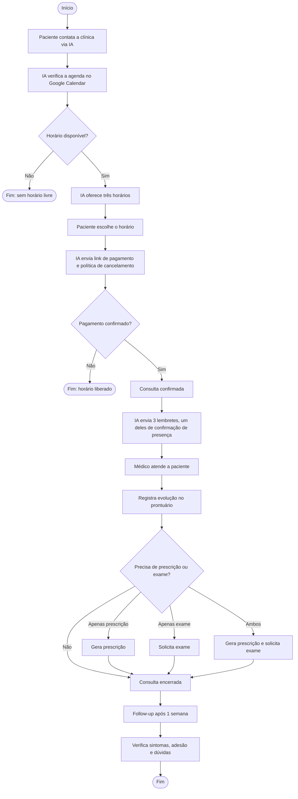
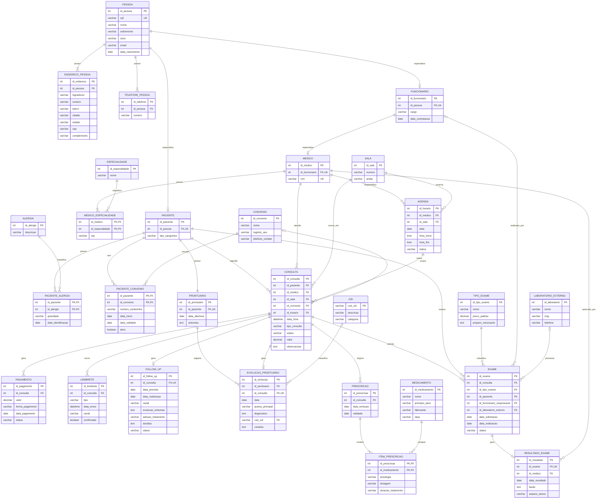

# Sistema de Gestão Clínica — Centro de Ginecologia Natural e Emocional

Projeto de **modelagem de banco de dados** para uma clínica de saúde da mulher. O modelo organiza em um único banco o cadastro de pacientes e profissionais, a agenda, as consultas, os pagamentos, o prontuário eletrônico, as prescrições e os exames. Hoje essas informações ficam espalhadas entre a IA de agendamento, o Google Calendar, o sistema de pagamento e anotações do profissional.

> Trabalho desenvolvido pelo **Grupo 3** na disciplina de **Modelagem de Dados**.

---

## Sumário

1. [Contexto do negócio](#1-contexto-do-negócio)
2. [Processo atual](#2-processo-atual)
3. [Problemas identificados](#3-problemas-identificados)
4. [Requisitos funcionais](#4-requisitos-funcionais)
5. [Requisitos não funcionais](#5-requisitos-não-funcionais)
6. [Regras de negócio](#6-regras-de-negócio)
7. [Aprovações e permissões](#7-aprovações-e-permissões)
8. [Modelo de dados](#8-modelo-de-dados)
9. [Decisões de modelagem](#9-decisões-de-modelagem)
10. [Pendências e próximos passos](#10-pendências-e-próximos-passos)
11. [Estrutura do repositório](#11-estrutura-do-repositório)
12. [Mapa das etapas da disciplina](#12-mapa-das-etapas-da-disciplina)

---

## 1. Contexto do negócio

| Item | Descrição |
|---|---|
| **Empresa** | Centro de Ginecologia Natural e Emocional |
| **Segmento** | Saúde da mulher — ginecologia natural e integrativa |
| **Oferta** | Consultas e tratamentos naturais para sintomas e diagnósticos ginecológicos |
| **Público principal** | Mulheres de 30 a 55 anos com SOP (síndrome dos ovários policísticos), endometriose, mioma, candidíase ou sintomas de perimenopausa |
| **Motivo da escolha** | A clínica pertence a uma pessoa próxima de um integrante do grupo, o que facilita o levantamento de requisitos |

### Informações estratégicas para a clínica

- Queixa principal e diagnóstico da paciente
- Perfil da paciente e histórico de tratamentos
- Taxa de comparecimento
- Taxa de remarcação

---

## 2. Processo atual

O agendamento e os lembretes já são automatizados por uma **IA de atendimento** sincronizada ao Google Calendar. Apenas o acompanhamento pós-consulta é manual.

```text
Paciente → Agendamento (IA) → Pagamento → Lembretes → Consulta → Follow-up (1 semana)
```

| Etapa | Participantes | Gatilho | O que acontece | Informação gerada | Resultado |
|---|---|---|---|---|---|
| **Agendamento** | Paciente e IA | Paciente pede uma consulta | A IA consulta o Google Calendar e oferece 3 horários livres | Data, horário e dados da paciente | Consulta marcada |
| **Pagamento** | Paciente e sistema de pagamento | Escolha do horário | A IA envia o link de pagamento e a política de cancelamento | Registro do pagamento | Consulta paga e confirmada |
| **Lembretes** | IA e paciente | Proximidade da consulta | São enviados 3 lembretes, sendo um deles de confirmação de presença | Presença confirmada ou não | Paciente ciente da consulta |
| **Consulta** | Paciente e profissional | Horário marcado | Atendimento clínico | Queixas, avaliação e plano de tratamento | Orientações ou protocolo definidos |
| **Follow-up** | Profissional e paciente | 1 semana após a consulta | Contato presencial ou por telefone | Evolução, adesão ao tratamento e dúvidas | Tratamento acompanhado e ajustado |

### Fluxograma

O fluxograma completo está em [`Fluxograma.drawio.xml`](Fluxograma.drawio.xml). Resumo:



---

## 3. Problemas identificados

| # | Problema | Consequência |
|---|---|---|
| 1 | Follow-up pós-consulta feito manualmente | Depende de o profissional lembrar; pode atrasar ou não acontecer |
| 2 | Não há prontuário eletrônico integrado | Dados clínicos ficam dispersos e podem se perder |
| 3 | Não há relatórios de agendamentos, faltas e cancelamentos | Difícil acompanhar o desempenho da clínica |
| 4 | Pagamento e agendamento em sistemas separados | Risco de o pagamento não ficar vinculado à consulta |

O modelo proposto responde a cada um deles:

| # | Como o modelo resolve |
|---|---|
| 1 | `FOLLOW_UP` registra a data prevista, a realização e o resultado de cada acompanhamento, permitindo cobrar os pendentes |
| 2 | `PRONTUARIO` e `EVOLUCAO_PRONTUARIO` centralizam o histórico clínico da paciente |
| 3 | Os status de `CONSULTA` (incluindo `falta` e `remarcada`) e a tabela `LEMBRETE` permitem calcular comparecimento, faltas e remarcações |
| 4 | `PAGAMENTO` fica vinculado à `CONSULTA` que o originou |

---

## 4. Requisitos funcionais

### Cadastros

| Cadastro | Dados registrados |
|---|---|
| **Pessoa** | Nome, sobrenome, CPF, sexo, e-mail, data de nascimento, endereços e telefones |
| **Paciente** | Vínculo com a pessoa e tipo sanguíneo |
| **Funcionário** | Vínculo com a pessoa, cargo e data de contratação |
| **Médico** | Vínculo com o funcionário e CRM |
| **Especialidade** | Nome da especialidade e RQE do médico em cada uma |
| **Sala** | Número e andar |
| **Convênio** | Nome, registro na ANS e telefone |
| **Alergia** | Descrição, com gravidade e data de identificação por paciente |
| **Medicamento** | Nome, princípio ativo, fabricante e tarja |
| **Tipo de exame** | Nome, preço padrão e preparo necessário |
| **Laboratório externo** | Nome, CNPJ e telefone |
| **CID** | Código, descrição e categoria |

### Operações

- **Convênios:** vincular a paciente a um ou mais convênios, com número da carteirinha, data de início e validade.
- **Agenda:** gerenciar os horários de cada médico (data, início, fim, sala e status) e consultar os horários livres.
- **Consulta:** marcar consultas vinculando paciente, médico, sala, horário da agenda e, se houver, convênio, com data/hora, tipo e status.
- **Lembretes:** registrar cada lembrete enviado pela IA (tipo, data, canal) e a confirmação de presença da paciente.
- **Follow-up:** agendar o acompanhamento 1 semana após a consulta e registrar canal, evolução dos sintomas, adesão ao tratamento e dúvidas.
- **Pagamento:** registrar valor, forma, data e status do pagamento de cada consulta.
- **Prontuário:** abrir um prontuário por paciente e registrar uma evolução a cada consulta (queixa principal, diagnóstico, CID e conduta).
- **Prescrição:** emitir prescrições vinculadas à consulta, com medicamento, posologia, dosagem e duração de cada item.
- **Exames:** solicitar exames vinculados à consulta e à paciente, acompanhar datas e status, indicar o laboratório externo e registrar o resultado (laudo, anexo e médico responsável).

---

## 5. Requisitos não funcionais

| Categoria | Requisito |
|---|---|
| **Segurança** | Controle de acesso por perfil (médico, funcionário e paciente); proteção do prontuário e das prescrições; registro de auditoria de quem alterou o quê e quando |
| **Privacidade (LGPD)** | Tratamento de dados sensíveis de saúde conforme a LGPD; a paciente pode solicitar seus próprios dados |
| **Desempenho** | Histórico da paciente disponível em tempo adequado durante o atendimento; agendamento sem demora perceptível |
| **Disponibilidade** | Agendamento disponível 24 horas; backup periódico para evitar perda do prontuário |
| **Usabilidade** | Interface simples para o profissional durante a consulta; interação fácil com a IA de agendamento |
| **Confiabilidade** | Agenda sempre sincronizada com o Google Calendar; sem duplicidade de horários; consulta só confirmada após o pagamento |
| **Integração** | Google Calendar (agenda dos médicos) e sistema de pagamento (geração e envio automático de links) |

---

## 6. Regras de negócio

| Código | Área | Regra |
|---|---|---|
| RN01 | Pessoas | Toda pessoa deve possuir CPF único. |
| RN02 | Pessoas | Cada paciente e cada funcionário correspondem a exatamente uma pessoa. |
| RN03 | Pessoas | Todo médico é um funcionário e deve possuir CRM válido e único. |
| RN04 | Pessoas | Um médico possui uma ou mais especialidades. |
| RN05 | Convênios | Uma paciente pode possuir vários convênios, cada um com data de validade. |
| RN06 | Convênios | A clínica só aceita convênios cadastrados, e o uso depende da validade da carteirinha. |
| RN07 | Convênios | Uma consulta pode ou não estar vinculada a um convênio (atendimento particular). |
| RN08 | Alergias | Uma paciente pode possuir várias alergias, cada uma com grau de gravidade. |
| RN09 | Agendamento | Toda consulta deve estar associada a uma paciente, a um médico e a uma sala disponível. |
| RN10 | Agendamento | Um médico não pode ter duas consultas no mesmo horário. |
| RN11 | Agendamento | A IA oferece 3 horários livres (ou todos os disponíveis, se houver menos de 3). |
| RN12 | Agendamento | Um horário só é considerado ocupado após a confirmação do agendamento. |
| RN13 | Pagamento | A consulta só é confirmada após o pagamento ou a confirmação do convênio. |
| RN14 | Pagamento | O status do pagamento é atualizado conforme a confirmação. |
| RN15 | Lembretes | A paciente recebe 3 lembretes antes da consulta, sendo um deles de confirmação de presença. |
| RN16 | Cancelamento | O cancelamento segue a política da clínica (prazo mínimo e reembolso); fora do prazo pode gerar cobrança. |
| RN17 | Prontuário | Toda paciente possui exatamente um prontuário. |
| RN18 | Prontuário | Toda consulta realizada gera uma evolução no prontuário. |
| RN19 | Prescrição | Toda prescrição está vinculada a uma consulta e contém pelo menos um item. |
| RN20 | Prescrição | Todo item de prescrição possui posologia e dosagem definidas. |
| RN21 | Exames | Todo exame está vinculado a uma consulta e a uma paciente, e pode ser processado por um laboratório externo. |
| RN22 | Exames | Todo exame realizado gera um resultado assinado por um médico. |
| RN23 | Follow-up | Toda consulta gera um follow-up 1 semana depois, para verificar sintomas e adesão ao tratamento. |

---

## 7. Aprovações e permissões

| Área | Quem pode | Observação |
|---|---|---|
| Prontuário | Somente o médico responsável altera | Acesso restrito à equipe médica |
| Dados cadastrais | Somente funcionários autorizados alteram | — |
| Dados financeiros | Somente a administração da clínica acessa | — |
| Follow-up | O profissional que atendeu confirma a realização | Prazo padrão de 1 semana |
| Dados próprios | A paciente acessa apenas os próprios dados | Direito garantido pela LGPD |

---

## 8. Modelo de dados

O modelo possui **28 entidades**. O dicionário completo (tipos, tamanhos, nulidade e descrições) está em [`Dicionario_de_Dados_Clinica.xlsx`](Dicionario_de_Dados_Clinica.xlsx).

### 8.1 Entidades

| Grupo | Entidades |
|---|---|
| **Pessoas** | `PESSOA`, `ENDERECO_PESSOA`, `TELEFONE_PESSOA`, `PACIENTE`, `FUNCIONARIO`, `MEDICO` |
| **Qualificação médica** | `ESPECIALIDADE`, `MEDICO_ESPECIALIDADE` |
| **Saúde da paciente** | `ALERGIA`, `PACIENTE_ALERGIA` |
| **Convênios** | `CONVENIO`, `PACIENTE_CONVENIO` |
| **Agenda e atendimento** | `SALA`, `AGENDA`, `CONSULTA`, `PAGAMENTO` |
| **Acompanhamento** | `LEMBRETE`, `FOLLOW_UP` |
| **Prontuário** | `PRONTUARIO`, `EVOLUCAO_PRONTUARIO`, `CID` |
| **Prescrição** | `MEDICAMENTO`, `PRESCRICAO`, `ITEM_PRESCRICAO` |
| **Exames** | `TIPO_EXAME`, `LABORATORIO_EXTERNO`, `EXAME`, `RESULTADO_EXAME` |

### 8.2 Diagrama entidade-relacionamento



> O diagrama editável está em [`Diagrama clínica.drawio`](Diagrama%20cl%C3%ADnica.drawio) e pode ser aberto no [diagrams.net](https://app.diagrams.net).

### 8.3 Relacionamentos e cardinalidades

Notação: `(mín, máx)` de cada lado, lida a partir da entidade indicada.

| Entidade A | Cardinalidade A | Relacionamento | Cardinalidade B | Entidade B | FK |
|---|---|---|---|---|---|
| PESSOA | (1,1) | possui | (1,N) | ENDERECO_PESSOA | `ENDERECO_PESSOA.id_pessoa` |
| PESSOA | (1,1) | possui | (1,N) | TELEFONE_PESSOA | `TELEFONE_PESSOA.id_pessoa` |
| PESSOA | (1,1) | especializa | (0,1) | PACIENTE | `PACIENTE.id_pessoa` |
| PESSOA | (1,1) | especializa | (0,1) | FUNCIONARIO | `FUNCIONARIO.id_pessoa` |
| FUNCIONARIO | (1,1) | especializa | (0,1) | MEDICO | `MEDICO.id_funcionario` |
| MEDICO | (1,1) | possui | (1,N) | MEDICO_ESPECIALIDADE | `MEDICO_ESPECIALIDADE.id_medico` |
| ESPECIALIDADE | (1,1) | classifica | (0,N) | MEDICO_ESPECIALIDADE | `MEDICO_ESPECIALIDADE.id_especialidade` |
| PACIENTE | (1,1) | possui | (0,N) | PACIENTE_ALERGIA | `PACIENTE_ALERGIA.id_paciente` |
| ALERGIA | (1,1) | classifica | (0,N) | PACIENTE_ALERGIA | `PACIENTE_ALERGIA.id_alergia` |
| PACIENTE | (1,1) | tem | (0,N) | PACIENTE_CONVENIO | `PACIENTE_CONVENIO.id_paciente` |
| CONVENIO | (1,1) | vincula | (0,N) | PACIENTE_CONVENIO | `PACIENTE_CONVENIO.id_convenio` |
| MEDICO | (1,1) | disponibiliza | (0,N) | AGENDA | `AGENDA.id_medico` |
| SALA | (1,1) | reserva | (0,N) | AGENDA | `AGENDA.id_sala` |
| PACIENTE | (1,1) | agenda | (0,N) | CONSULTA | `CONSULTA.id_paciente` |
| MEDICO | (1,1) | atende | (0,N) | CONSULTA | `CONSULTA.id_medico` |
| SALA | (1,1) | ocorre em | (0,N) | CONSULTA | `CONSULTA.id_sala` |
| AGENDA | (1,1) | ocupa | (0,N) | CONSULTA | `CONSULTA.id_horario` |
| CONVENIO | (0,1) | cobre | (0,N) | CONSULTA | `CONSULTA.id_convenio` (opcional) |
| CONSULTA | (1,1) | gera | (0,N) | PAGAMENTO | `PAGAMENTO.id_consulta` |
| CONSULTA | (1,1) | envia | (0,N) | LEMBRETE | `LEMBRETE.id_consulta` |
| CONSULTA | (1,1) | gera | (0,1) | FOLLOW_UP | `FOLLOW_UP.id_consulta` (único) |
| PACIENTE | (1,1) | possui | (1,1) | PRONTUARIO | `PRONTUARIO.id_paciente` (único) |
| PRONTUARIO | (1,1) | registra | (0,N) | EVOLUCAO_PRONTUARIO | `EVOLUCAO_PRONTUARIO.id_prontuario` |
| CONSULTA | (1,1) | gera | (0,1) | EVOLUCAO_PRONTUARIO | `EVOLUCAO_PRONTUARIO.id_consulta` |
| CID | (0,1) | classifica | (0,N) | EVOLUCAO_PRONTUARIO | `EVOLUCAO_PRONTUARIO.cod_cid` (opcional) |
| CONSULTA | (1,1) | origina | (0,N) | PRESCRICAO | `PRESCRICAO.id_consulta` |
| PRESCRICAO | (1,1) | contém | (1,N) | ITEM_PRESCRICAO | `ITEM_PRESCRICAO.id_prescricao` |
| MEDICAMENTO | (1,1) | compõe | (0,N) | ITEM_PRESCRICAO | `ITEM_PRESCRICAO.id_medicamento` |
| CONSULTA | (1,1) | solicita | (0,N) | EXAME | `EXAME.id_consulta` |
| PACIENTE | (1,1) | realiza | (0,N) | EXAME | `EXAME.id_paciente` |
| TIPO_EXAME | (1,1) | classifica | (0,N) | EXAME | `EXAME.id_tipo_exame` |
| FUNCIONARIO | (0,1) | realizado por | (0,N) | EXAME | `EXAME.id_funcionario_responsavel` (opcional) |
| LABORATORIO_EXTERNO | (0,1) | processa | (0,N) | EXAME | `EXAME.id_laboratorio_externo` (opcional) |
| EXAME | (1,1) | gera | (0,1) | RESULTADO_EXAME | `RESULTADO_EXAME.id_exame` |
| MEDICO | (1,1) | assinado por | (0,N) | RESULTADO_EXAME | `RESULTADO_EXAME.id_medico` |

### 8.4 Relacionamentos N:N e entidades associativas

O modelo possui **quatro** relacionamentos N:N, todos resolvidos por entidades associativas com **chave primária composta**:

| Relacionamento N:N | Entidade associativa | PK composta | Atributos próprios | Justificativa |
|---|---|---|---|---|
| MEDICO ↔ ESPECIALIDADE | `MEDICO_ESPECIALIDADE` | `id_medico` + `id_especialidade` | `rqe` | O RQE é o registro do médico **naquela** especialidade; não pertence só ao médico nem só à especialidade. |
| PACIENTE ↔ ALERGIA | `PACIENTE_ALERGIA` | `id_paciente` + `id_alergia` | `gravidade`, `data_identificacao` | A mesma alergia pode ter gravidades diferentes em pacientes diferentes. |
| PACIENTE ↔ CONVENIO | `PACIENTE_CONVENIO` | `id_paciente` + `id_convenio` | `numero_carteirinha`, `data_inicio`, `data_validade`, `ativo` | Carteirinha e vigência pertencem ao vínculo, não ao convênio. |
| PRESCRICAO ↔ MEDICAMENTO | `ITEM_PRESCRICAO` | `id_prescricao` + `id_medicamento` | `posologia`, `dosagem`, `duracao_tratamento` | O mesmo medicamento tem dosagens diferentes em prescrições diferentes. |

### 8.5 Restrições de integridade

| Restrição | Onde | Regra atendida |
|---|---|---|
| `UNIQUE (cpf)` | PESSOA | RN01 |
| `UNIQUE (id_pessoa)` | PACIENTE, FUNCIONARIO | RN02 |
| `UNIQUE (id_funcionario)`, `UNIQUE (crm)` | MEDICO | RN03 |
| `UNIQUE (id_paciente)` | PRONTUARIO | RN17 |
| `UNIQUE (id_consulta)` | EVOLUCAO_PRONTUARIO | RN18 (uma evolução por consulta) |
| `UNIQUE (id_exame)` | RESULTADO_EXAME | RN22 (um resultado por exame) |
| `UNIQUE (id_consulta)` | FOLLOW_UP | RN23 (um follow-up por consulta) |
| `UNIQUE (id_medico, data, hora_inicio)` | AGENDA | RN10 |
| `CHECK (hora_fim > hora_inicio)` | AGENDA | Consistência do horário |
| `NOT NULL (data_validade)` | PACIENTE_CONVENIO | RN05 |

**Domínios de status**

| Campo | Valores |
|---|---|
| `AGENDA.status` | disponivel, reservado, ocupado, bloqueado |
| `CONSULTA.status` | agendada, confirmada, realizada, cancelada, remarcada, falta |
| `PAGAMENTO.status` | pendente, pago, estornado (`data_pagamento` fica nula enquanto pendente) |
| `LEMBRETE.tipo` | aviso, confirmacao_presenca |
| `FOLLOW_UP.status` | pendente, realizado, sem retorno |

---

## 9. Decisões de modelagem

**Generalização de PESSOA.** Os dados comuns (CPF, nome, sobrenome, sexo, e-mail e data de nascimento) ficam em `PESSOA`, especializada em `PACIENTE` e `FUNCIONARIO`. Isso evita cadastro duplicado: uma médica que também é paciente da clínica tem um único registro de pessoa. A cardinalidade `(0,1)` do lado da pessoa indica que ela pode não exercer nenhum dos papéis; o `(1,1)` do outro lado garante que todo paciente ou funcionário seja uma pessoa.

**MEDICO como especialização de FUNCIONARIO.** Todo médico é contratado pela clínica, então herda `cargo` e `data_contratacao` de `FUNCIONARIO` e acrescenta apenas o `crm`. Com isso o CRM deixa de existir como campo opcional em `FUNCIONARIO` e fica em um único lugar.

**Endereço e telefone em tabelas próprias.** Uma pessoa pode ter vários endereços e telefones; colocá-los em `PESSOA` obrigaria a limitar a quantidade ou a criar colunas repetidas.

**AGENDA separada de CONSULTA.** `AGENDA` representa o horário que o médico disponibiliza; `CONSULTA` representa o atendimento marcado com a paciente. Essa separação permite que a IA busque somente os horários com `status` livre e ofereça as 3 opções previstas na RN11. A consulta aponta para o horário que ocupa (`CONSULTA.id_horario`); ao confirmar o pagamento, o horário passa a `ocupado` (RN12). A ligação é `(0,N)` do lado da consulta para que um horário liberado por cancelamento possa ser remarcado sem apagar o histórico.

**Lembretes e follow-up registrados.** `LEMBRETE` guarda cada mensagem enviada pela IA e a resposta de confirmação de presença (RN15), base para medir comparecimento. `FOLLOW_UP` nasce com a data prevista de 1 semana após a consulta e só é concluído quando o profissional registra o contato, tirando o acompanhamento da memória do profissional (problema 1, RN23).

**Convênio opcional na consulta.** `CONSULTA.id_convenio` aceita nulo para permitir atendimentos particulares (RN07).

**PAGAMENTO vinculado à CONSULTA.** Resolve o problema 4: toda cobrança fica ligada ao atendimento que a originou, e a clínica passa a ter histórico financeiro por consulta. A relação é `(0,N)` porque uma consulta coberta por convênio pode não gerar pagamento direto e uma consulta particular pode ter mais de uma tentativa (ex.: pagamento recusado e depois aprovado).

**Prontuário único com várias evoluções.** `PRONTUARIO` representa o histórico da paciente (um por paciente) e `EVOLUCAO_PRONTUARIO` registra cada atendimento, resolvendo o problema 2.

**CID como tabela de referência.** O código CID-10 deixou de ser texto livre e passou a ser FK para `CID`. Isso padroniza os diagnósticos e permite relatórios por doença (ex.: quantas pacientes com endometriose).

**TIPO_EXAME e LABORATORIO_EXTERNO separados.** Evitam repetir nome, preço e preparo a cada solicitação. O laboratório é opcional porque nem todo exame é feito fora da clínica.

**Resultado assinado por médico.** `RESULTADO_EXAME.id_medico` identifica o responsável pelo laudo, atendendo à exigência de rastreabilidade.

---

## 10. Pendências e próximos passos

### Pontos a validar com a clínica

- [ ] Quais são os setores da clínica?
- [ ] Um médico pode ter mais de uma especialidade? (RN04)
- [ ] Uma paciente pode ter mais de um convênio ativo ao mesmo tempo? (RN05)
- [ ] Toda prescrição precisa ter ao menos um medicamento? (RN19)
- [ ] O follow-up pode ser disparado automaticamente pela IA, ou só o profissional confirma?
- [ ] Qual é a política de cancelamento (prazo mínimo, reembolso e multa)?

### Evoluções previstas no modelo

- [ ] **Usuários e auditoria:** tabelas de perfil de acesso e log de alterações (requisitos de segurança).
- [ ] **Cancelamento:** campos de prazo, reembolso e multa, após a clínica definir a política.

### Histórico de revisões do modelo

| Revisão | Alterações |
|---|---|
| Diário AL05 | Inclusão do CID como tabela de referência para os diagnósticos |
| Diário AL06 | Auditoria do modelo lógico: PKs, FKs e entidades associativas revisadas |
| Revisão de consistência | README, dicionário, DER e fluxograma alinhados; `MEDICO` passa a especializar `FUNCIONARIO`; novas tabelas `FOLLOW_UP` e `LEMBRETE`; FK `CONSULTA.id_horario`; `LABORATORIO_EXTERNO` e `CID` incluídos no DER; cardinalidades e restrições corrigidas |

---

## 11. Estrutura do repositório

| Arquivo | Conteúdo |
|---|---|
| `README.md` | Documentação do projeto (este arquivo) |
| `Diagrama clínica.drawio` | Diagrama entidade-relacionamento editável |
| `Dicionario_de_Dados_Clinica.xlsx` | Dicionário de dados completo e resumo das entidades |
| `Fluxograma.drawio.xml` | Fluxograma do processo de atendimento |
| `DIARIO_DE_BORDO_AL05.pdf` | Diário de bordo da aula 5 — modelagem conceitual avançada |
| `DIARIO_DE_BORDO_AL06.pdf` | Diário de bordo da aula 6 — auditoria do modelo lógico |

---

## 12. Mapa das etapas da disciplina

| Etapa | Tema | Seção |
|---|---|---|
| 1 | Identificação da empresa | [1. Contexto do negócio](#1-contexto-do-negócio) |
| 2 | Escolha da empresa | [1. Contexto do negócio](#1-contexto-do-negócio) |
| 3 | Processo atual | [2. Processo atual](#2-processo-atual) |
| 4 | Problemas identificados | [3. Problemas identificados](#3-problemas-identificados) |
| 5 | Cadastros gerais | [4. Requisitos funcionais](#4-requisitos-funcionais) |
| 6 | Requisitos não funcionais | [5. Requisitos não funcionais](#5-requisitos-não-funcionais) |
| 7 | Regras de negócio | [6. Regras de negócio](#6-regras-de-negócio) |
| 8 | Aprovações e alterações | [7. Aprovações e permissões](#7-aprovações-e-permissões) |
| 9 | Fluxograma | [2. Processo atual](#fluxograma) |
| 10 | Entidades | [8.1 Entidades](#81-entidades) |
| 11 | Dicionário de dados | [8.2 Diagrama ER](#82-diagrama-entidade-relacionamento) e planilha |
| 12 | Relacionamentos | [8.3 Relacionamentos e cardinalidades](#83-relacionamentos-e-cardinalidades) |
| 13 | Cardinalidades | [8.3 Relacionamentos e cardinalidades](#83-relacionamentos-e-cardinalidades) |
| 14 | Relacionamentos N:N | [8.4 N:N e associativas](#84-relacionamentos-nn-e-entidades-associativas) |
| 15 | Entidades associativas | [8.4 N:N e associativas](#84-relacionamentos-nn-e-entidades-associativas) |
| 18 | Justificativa das decisões | [9. Decisões de modelagem](#9-decisões-de-modelagem) |
